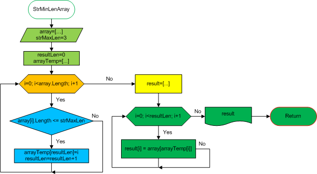

# **Описание решения задачи**

Задача: Написать программу, которая из имеющегося массива строк формирует новый массив из строк, длина которых меньше, либо равна 3 символам.
Первоначальный массив можно ввести с клавиатуры, либо задать на старте выполнения алгоритма.
При решении не рекомендуется пользоваться коллекциями, лучше обойтись исключительно массивами.

***Содержание:***

***1. Основной метод (Main)***  
***2. Метод решения задачи***  
***3. Метод ввода целых чисел***  
***4. Метод вывода массива***  
***5. Метод ручного заполнения массива***  
***6. Метод автоматического заполнения массива***  
***7. Метод отбора значений в новый массив***  
***8. Метод выбора случайных значений***

## Основной метод (*Main*)

Основной метод программы представляет собой меню, организованное внутри бесконечного цикла.
Меню позволяет посредством оператора *switch* выбрать способ заполнения стартового массива строк, либо завершить выполнение программы.
Выбор способа заполнения массива выполняется посредством передачи методу *TaskStr()* соответствующего логического параметра.

## Метод решения задачи - *TaskStr()*

Метод *TaskStr()* обеспечивает выполнение основных операций для решения поставленной задачи.
Для этого в методе последовательно вызываются другие методы обеспечивающие выполнение необходимых действий.

Изначально, посредством метода *SetNumber()*, выполняется запрос к пользователю, с просьбой ввести количество элементов стартового массива.
Затем, посредством оператора выбора, на основе переданного методу логического параметра *autoArray*, массив заполняется значениями. Для этого вызывается либо метод *ManualArrayComplet()*, для ручного заполнения пользователем с клавиатуры, либо вызывается метод *AutoArrayComplet()*, для автоматического заполнения массива строками из внешнего источника.
Заданный массив выводится на экран посредством метода *PrintArray()*.

После этого стартовый массив передаётся методу *StrMinLenArray()*, который формирует новый массив строк, соответствующих заданной их длине.

Новый массив выводится на экран посредством метода *PrintArray()*, после чего организуется пауза, вплоть до нажатия пользователем любой клавиши, с помощью оператора *Console.ReadKey()*. В случае если метод *StrMinLenArray()* возвращает массив единичной длины со значением элемента не соответствующим заданным условиям, значит не было найдено ни одного значения стартового массива заданной длины. В этом случае на экран выводится пустой массив.

После нажатия клавиши осуществляется возврат к главному меню программы.

## Метод ввода целых чисел - *SetNumber()*

Данный метод выводит принятую в качестве параметра строку текста, в качестве запроса к пользователю, после чего ожидает ввода строки.
Принятая строка преобразуется в целое числовое значение, передаваемое переменной *num*.
После чего осуществляется возврат значения переменной *num*.

## Метод вывода массива - *PrintArray()*

Данный метод осуществляет форматированный вывод в консоль принятого в качестве параметра массива.
Массив заключается в квадратные скобки, значения массива выводятся через запятую, заключёнными в двойные кавычки.

## Метод ручного заполнения массива - *ManualArrayComplet()*

Данный метод в цикле запрашивает от пользователя значения элементов, с последующим возвратом заполненного массива.

## Метод автоматического заполнения массива - *AutoArrayComplet()*

Данный метод заполняет массив заданной размерности случайтыми значениями возвращаемыми методом *StrArray()*.

## Метод отбора значений в новый массив - *StrMinLenArray()*

Данный метод решает основную задачу, выбирает из стартового массива значения отвечающие требованиям к длине строки, и формирует из них новый массив.

Так как при выполнении задачи рекомендуется использовать только стандартные циклы, в данном методе используются два цикла и вспомогательный массив *arrayTemp[]*, используемый для хранения индексов найденных строк искомой длины.

В первом цикле осуществляется проверка всех элементов заданного массива на соответствие их длины заданным параметрам.
Индексы найденных элементов последовательно заносятся в массив *arrayTemp[]*, при этом ведётся подсчёт найденных элементов посредством переменной *resultLen*.

Далее проверяется значение *resultLen*. Если ни одного элемента соответствующего заданным условиям найдено не было, метод возвращает массив единичной длины, с заведомо неправильным значением, в качестве которого используется значение нулевого элемента стартового массива.

При наличии найденных элементов, их копируют, посредством второго цикла, из стартового в результирующий массив. После чего метод возвращает полученный массив *result*.

Блок-схема данного алгоритма представлена ни рисунке ниже.

## Метод выбора случайных значений - *StrArray()*

Данный метод возвращает значения массива строк, находящегося внутри метода. При необходимости выбора строк из какого-либо внешнего источника, необходимо лишь изменить данный метод. При этом остальные методы программы останутся неизменными. Данный способ хранения строковых значений выбран лишь для повышения универсальности данной программы.